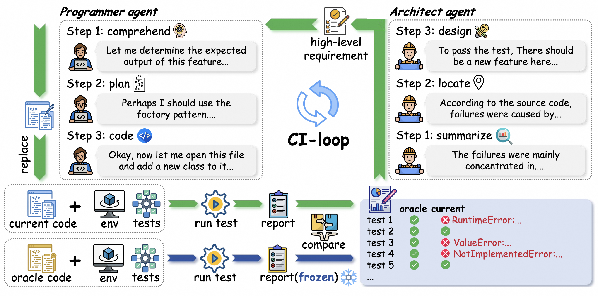

# SWE-CI: Evaluating Agent Capabilities in Maintaining Codebases via Continuous Integration

<p align="center">
  [简体中文] | English
</p>

🔗 HuggingFace 链接: https://huggingface.co/datasets/skylenage/SWE-CI

🔗 论文链接: 即将发布...

## 介绍



### 🏆 SWE-CI 是什么？

代码可维护性在软件生命周期中至关重要。而SWE-CI 是首个专门评估 *AI智能体维护仓库的能力* 的测评基准。SWE-CI 的核心洞见在于：**好的维护不仅要确保当前代码的功能正确，更要尽量降低代码在未来持续保持功能正确的开发难度。**

SWE-CI从Github中筛选了100对高质量代码提交版本。其中，每一对代码提交版本都包含一份基准代码和一份参考代码，它们选取自同一个代码库的不同时期。SWE-CI要求AI智能体从基准代码开始维护，并以完全通过参考代码的中的测试作为目标。通过量化代码演化序列持续保持功能正确性的程度，SWE-CI可以有效的衡量AI智能体维护代码的能力。

SWE-CI 引入了一种独特的**双智能体协作工作流**，以模拟真实专业软件团队在维护代码时的持续集成循环（CI-loop）：

- **架构师智能体（Architect Agent）**：负责分析由自动化测试系统提供的测试信息。通过失败归因、代码定位和需求设计，产出专业且高层次且自然语言形式的需求文档。并交由程序员完成开发。

- **程序员智能体（Programmer Agent）**：在接收到需求文档后，程序员智能体需要将文档中的需求翻译为明确代码行为规范，规划代码的维护计划并最终实施编码。

通过反复执行 **「运行测试 → 定义需求 → 修改代码」** 的闭环流程，SWE-CI 有效模拟了真实世界的软件开发迭代周期，为系统性地衡量智能体**长期维护**代码库的综合能力提供了新平台。

### 🏆 为什么需要 SWE-CI？

相比于之前的基准测试，SWE-CI 引入了**三大核心转变**：

#### 1️⃣ 从「快照修复」到「演化追踪」

当前大多数主流评测基准遵循是 **「Issue → PR」** 的单点修复范式：给定某一时刻的 Bug 报告，模型必须一次性完成修复。然而，真实世界中的软件工程任务几乎从不是一次性完成的。 SWE-CI 不再聚焦于单个 Bug 的修复，而是关注**两个提交版本之间的演化轨迹**（从当前提交到目标提交）。它真实还原了代码库随时间不断生长、重构与演进的动态过程。

#### 2️⃣ 从「静态需求描述」到「动态需求生成」

SWE-CI 不依赖人工事先编写的 Issue 描述，转而以当前代码与参考代码的 **「测试差异（Test Gap）」** 作为生成需求文档的核心驱动力。在现实世界软件工程中，需求往往高度依赖于当前代码状态，且难以被提前预测。而该过程通过引入持续集成中的自动化测试流程，实现了代码功能缺陷的实时感知与自动化需求生成。

#### 3️⃣ 从「评估写正确的代码」到「评估写可维护的代码」

SWE-CI不仅关注智能体是否能在单轮尝试中正确实现需求，更关心这种正确性是否能在未来得到保持。通过代码变更序列的功能正确性的持续追踪，SWE-CI客观地量化了'维护能力'这一模糊的概念。并为构建更强大的智能体系统提供新的见解。


## 排行榜


在SWE-CI中，我们使用平均正则改变（Average Normalized Change, ANC）衡量模型维护代码的能力。我们定义以下符号：

*   $p_i^{(j)}$：第 $j$ 个任务在第 $i$ 次迭代时代码通过的单元测试数量。其中，$p_0^{(j)}$ 表示第 $j$ 个任务在迭代开始前初始代码所通过的单元测试数量。
*   $p_{\ast}^{(j)}$：第 $j$ 个任务中需要通过的单元测试总数，等价于参考代码（ground truth）所通过的单元测试数量。
*   $N$：最大迭代轮次。
*   $M$：数据集中的任务总数。

我们首先定义正则改变（Normalized Change，NC）为某轮次中相对于基线情况下的相对改进（包括正向改进和负向改进）：

$$
a_i^{(j)}=\left\{
\begin{aligned}
& \frac{p_i^{(j)}-p_0^{(j)}}{p_\ast^{(j)}-p_0^{(j)}}, & \text{if}\,\,p_i^{(j)} \geq p_0^{(j)}\\
& \frac{p_i^{(j)}-p_0^{(j)}}{p_0^{(j)}}, & \text{if}\,\,p_i^{(j)} < p_0^{(j)}
\end{aligned}
\right.
$$

则平均正则改变被定义为：

$$
{\rm ANC} =\frac{1}{MN}\sum_{j=1}^M\sum_{i=1}^N a_i^{(j)}
$$

该指标综合考虑了智能体在代码维护全部周期的功能正确性变化，从而作为智能体维护代码能力的可靠度量。


## 快速开始

### 🌍 适用性
仓库目前仅支持 Linux 操作系统 和 iFlow CLI。未来将逐步支持Windows 操作系统，CaludeCode CLI 和 OpenCode CLI。
### 💰 参考开销
在以下测试环境下，在全量数据集 (full.csv) 上运行本项目约需 **48 小时**：
+ 硬件配置：32-core CPU, 64 GB RAM, 约 1 GB/s 磁盘读写速度
+ 并发设置：16 并发
+ API Key：至少 16 个并发请求的 LLM API Key。

### 🚀 安装

**步骤1：** 本仓库基于 Docker 开发，在首次运行本仓库之前请先使用以下命令确保 Docker 正常运行。
```bash
docker run hello-world
```
理想情况下，您将会在输出中看到 “Hello form Docker!” 的字样。 您可以在 [这里](https://www.docker.com/get-started/) 查阅Docker的安装方式。

**步骤2:** 从 Github 下载并安装该项目。默认使用 [Anaconda](https://www.anaconda.com/download) / [Miniconda](https://www.anaconda.com/docs/getting-started/miniconda/install) / [Miniforge](https://github.com/conda-forge/miniforge) 管理Python环境。
```bash
git clone https://github.com/Loong-Chan/SWE-CI.git
cd SWE-CI

conda create --name sweci python=3.11 -y
conda activate sweci
pip install -r requirements.txt
```

### 🏃 运行

**从 Hugging Face 下载数据集：** 首次运行试验需要先从 Hugging Face 上下载数据。全量数据集（full.csv）大约需要 52.8Gb 存储空间。
```bash
# （推荐）使用默认参数下载
PYTHONPATH=src python -m swe_ci.download

# （个性化）使用自定义参数下载
# --splitting: 可选，数据集划分，默认值 "full"
# --hf_token: 可选，用于加速加载，默认值 "none"
PYTHONPATH=src python -m swe_ci.download \
    --splitting <SPLITTING> \
    --hf_token <HF_TOKEN>
```

**运行实验**：
+ 在默认情况下，您可以完全使用命令行传递参数。其中，`--api_key` / `--base_url` / `--model_name` 兼容OpenAI的接口协议。您也可以通过将 `--iflow.auth_type` 设置为 `iflow`以使用 iFlow 接口协议，详细信息请查阅 [iFlow 官方文档](https://platform.iflow.cn/docs)。
+ 本实验包含 *任务初始化* 和 *代码演进* 两个阶段。任务初始化大约耗时30分钟（并发数=16时）。当系统资源比较紧张时，个别任务可能会初始化超时。此时请适当降低对Docker容器的资源限制或减少并发数并重新执行命令。只有当所有任务完成初始化之后才会进入代码演化阶段（约48小时）。
```bash
# --experiment_name 必填，用于唯一标识该实验的字符串，通过复用 experiment_name 可以实现断点续跑
# --splitting 可选，默认值 "full"，数据集划分，应与下载时使用的参数保持一致
# --api_key / --base_url / --model_name 必填
PYTHONPATH=src nohup python -u -m swe_ci.evaluate \
    --experiment_name <EXPERIMENT_NAME> \
    --splitting <SPLITTING> \
    --api_key <API_KEY> \
    --base_url <BASE_URL> \
    --model_name <MODEL_NAME> \
    > temp.log 2>&1 &
```
+ 更方便的做法是，您可以直接修改项目中的 config.toml 文件，并为其中的任意参数重新设置默认参数。以实现更精细的实验设置和避免在命令行重复输入参数。
```bash
# 假设所有必填项都已经在config.toml中被设置
PYTHONPATH=src nohup python -u -m swe_ci.evaluate > temp.log 2>&1 &
```
+ 如果您有在多组不同的设置下运行实验的需求，我们建议您为每一组实验单独创建一份配置文件，并使用 `--config_file` 参数指定您的个性化配置文件。
```bash
# 假设创建一份新的配置文件 my_config_1.toml（需与config.toml 位于同一目录下，且配置项与config.toml相同），并已在其中指定所有必填项。
PYTHONPATH=src nohup python -u -m swe_ci.evaluate \
    --config_file my_config_1.toml \
    > temp.log 2>&1 &
```
⚠️ 由于实验运行时间较长（16并发下需要约48小时），我们建议您在执行上述命令后记录下命令的PID以便在必要时候任何必要时候提前杀死进程。

⚠️ 您可以根据自身的资源情况在 config.toml 中调整并发数和 Docker 容器的资源使用限制，包括CPU、内存和IO。

⚠️ 由于某些意外情况（如：API Key的并发数超过限制，或Agent的不恰当的修改使得代码运行超时）导致个别任务执行失败属于正常现象。大多数情况下可以通过重新运行试验解决。

### 📄 查看试验结果
您可以通过指定 ` --experiment_name` 和 `--splitting` 参数来查看试验结果。
```bash
PYTHONPATH=src python -m swe_ci.summarize \
    --experiment_name <EXPERIMENT_NAME> \
    --splitting <SPLITTING>
```

